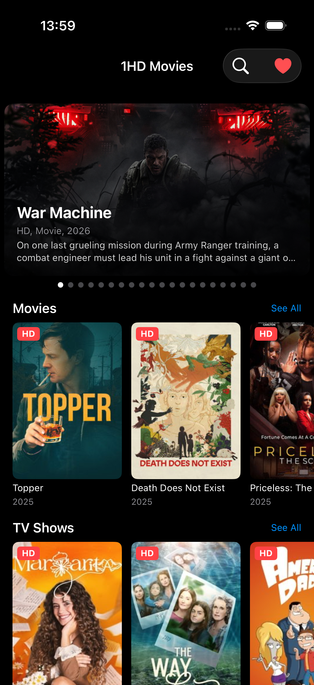

# 1HDMovies

1HDMovies is an iOS client for [1hd.art website](https://1hd.art). 1HD is a free TV shows streaming website with zero ads, it allows you to watch TV shows online, watch movies online free in high quality for free. You can also browse by genre, save favorites, and search the entire library.

## Disclaimer
This app is not official. It was made for personal usage on iPhone/iPad, so all problems and issues which are in, made in purpose or because I'm lazy. But I will improve that product for usage when these bugs will be found.

## App Screenshots

**So, what can I do with this app?**
- Watch Most Popular Movies and TV Shows on the dashboard carousel
- Browse Top Popular Movies and TV Shows
- Browse all Movies and TV Shows with pagination
- Browse by genre: Action, Comedy, Drama, Fantasy, Horror, Mystery, Top IMDB
- View movie/show details with cast, genre, IMDB rating, duration, country, production info
- Browse seasons and episodes for TV shows
- Save movies and TV shows to favorites
- Search by name of the movie or TV show
- Watch movies and TV shows with native iOS video player
- See "You May Also Like" recommendations

## Architecture
- **SwiftUI** - UI framework
- **MVVM** - Architecture pattern with `@Observable` ViewModels
- **async/await** - Concurrency

## Dependencies
- [SwiftSoup](https://github.com/scinfu/SwiftSoup) - HTML parsing
- URLSession - HTTP client
- AVKit - Video playback
- WebKit - Stream detection
- UserDefaults - Favorites storage

## Requirements
- iOS 26.0+
- Xcode 26.0+
- Swift 5.0+

## Author

Me
